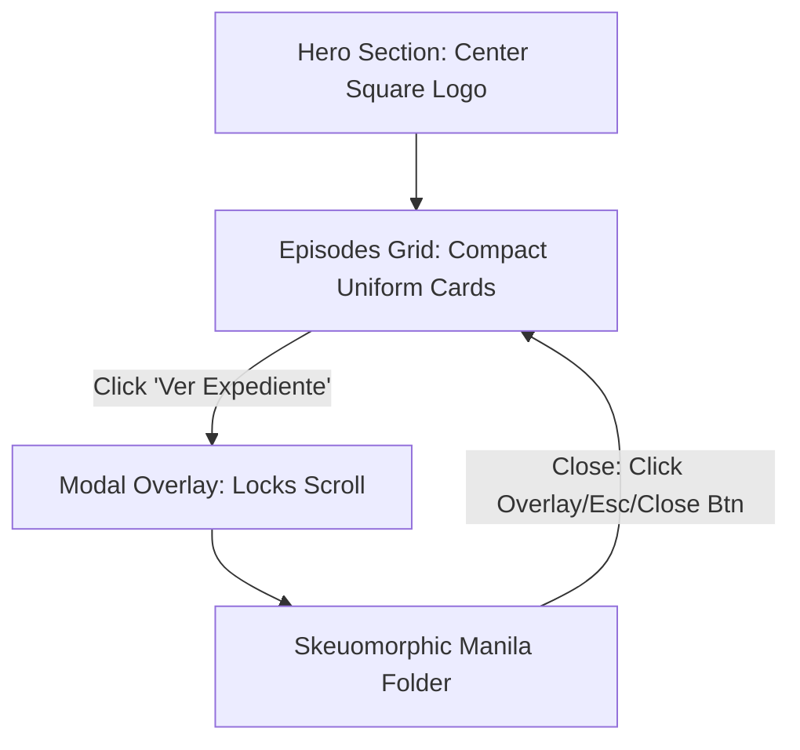

# Technical Design: Layout, Modal & Logo Refactor

## Technical Approach
The landing page layout will be streamlined by simplifying the Hero logo framing, transforming the episode list into a uniform compact grid of cards, and moving the detailed, skeuomorphic folder views into a React client-side modal. 



---

## Key Architecture Decisions

| Feature | Option | Tradeoff | Decision |
|---|---|---|---|
| **Hero Logo** | Direct image with filter vs wrapper frame | Direct image is simpler and matches square aspect ratio; wrapper adds decorative borders. | Remove wrapper [page.module.css#L84-L100](file:///home/nayssakristel/Proyectos/Podcast/src/app/page.module.css#L84-L100). Style `.heroLogo` directly. |
| **Grid Cards** | Standard Flexbox card vs Full Manila Folder | Standard card reduces landing page cognitive load; folder is visually complex. | Render compact crema cards in grid; move folders to modal. |
| **Modal State** | Vanilla React State vs Headless Dialog | React state is dependency-free and easy to customize; library handles accessibility. | Approach 1 (Vanilla React State: `selectedEpisodeIndex` in [page.tsx](file:///home/nayssakristel/Proyectos/Podcast/src/app/page.tsx)). |
| **Scroll Lock** | CSS Class toggling vs Page wrappers | Dynamic `document.body` class is clean and direct; wrapper requires layout changes. | Dynamic scroll lock using `overflow: hidden` in `useEffect`. |

---

## Interfaces / Contracts

The `Track` metadata structure defined in [AudioPlayer.tsx](file:///home/nayssakristel/Proyectos/Podcast/src/components/AudioPlayer.tsx#L6-L11) will be used for both card-level players and modal players. No interface modifications are needed.

```typescript
export interface Track {
  title: string;
  description: string;
  url: string;
  duration: string;
}
```

---

## Detailed Component & Style Changes

### 1. Hero Logo Refactor
Remove the circular frame wrapper `.heroLogoFrame` from [page.tsx](file:///home/nayssakristel/Proyectos/Podcast/src/app/page.tsx#L106-L108). Render `/logo.png` directly inside Hero content.
```css
.heroLogo {
  width: 100%;
  max-width: 420px;
  aspect-ratio: 1/1;
  object-fit: contain;
  margin-bottom: 2rem;
  mix-blend-mode: multiply;
  filter: sepia(0.2) contrast(1.1) brightness(0.95);
}
```

### 2. Compact Episode Grid Card
Style `.episodeCard` in [page.module.css](file:///home/nayssakristel/Proyectos/Podcast/src/app/page.module.css) as a standard card with crema background, subtle shadow/borders, and uniform heights:
```css
.episodeCard {
  background-color: var(--color-bg-alt, #faf7f0);
  border: 1px solid rgba(194, 141, 93, 0.3);
  border-radius: 6px;
  padding: 1.5rem;
  display: flex;
  flex-direction: column;
  height: 100%;
  justify-content: space-between;
  box-shadow: 0 4px 6px rgba(0, 0, 0, 0.05);
}
.episodeDescription {
  display: -webkit-box;
  -webkit-line-clamp: 3;
  -webkit-box-orient: vertical;
  overflow: hidden;
}
```

### 3. Modal Overlay & Case Folder
Inside [page.tsx](file:///home/nayssakristel/Proyectos/Podcast/src/app/page.tsx):
- Add state `selectedEpisodeIndex: number | null`.
- Add active tab state for the open folder: `activeTab: 'book' | 'forensic'`.
- Use a `useEffect` hook to toggle `.bodyScrollLock` class on `document.body` when `selectedEpisodeIndex !== null`.
- Add an `Escape` key event listener in a `useEffect` hook to close the modal.

```css
.bodyScrollLock {
  overflow: hidden;
}
.modalOverlay {
  position: fixed;
  top: 0;
  left: 0;
  width: 100vw;
  height: 100vh;
  z-index: 1000;
  background: rgba(46, 30, 28, 0.7);
  display: flex;
  justify-content: center;
  align-items: flex-start;
  overflow-y: auto;
  padding: 2rem 1rem;
}
.modalContainer {
  position: relative;
  width: 100%;
  max-width: 800px;
}
```
In the skeuomorphic folder, position a typewriter-styled Close button (`.closeBtn`) at the top right of the folder that sets `selectedEpisodeIndex(null)`.

### 4. AudioPlayer Scaling
The existing `AudioPlayer` wrapper needs flex scaling to adapt inside both grid cards and the modal container without absolute dimensions. Ensure the player's flex containers are fluid.

---

## Testing Strategy
1. **Modal Escape Listener**: Verify that pressing `Escape` closes the modal overlay.
2. **Scroll Locking**: Verify that the document page cannot be scrolled when the modal is open.
3. **Responsiveness**: Verify that the Hero logo shrinks on mobile viewports and that the modal layout scrolls vertically on smaller heights without clipping the case folder content.
