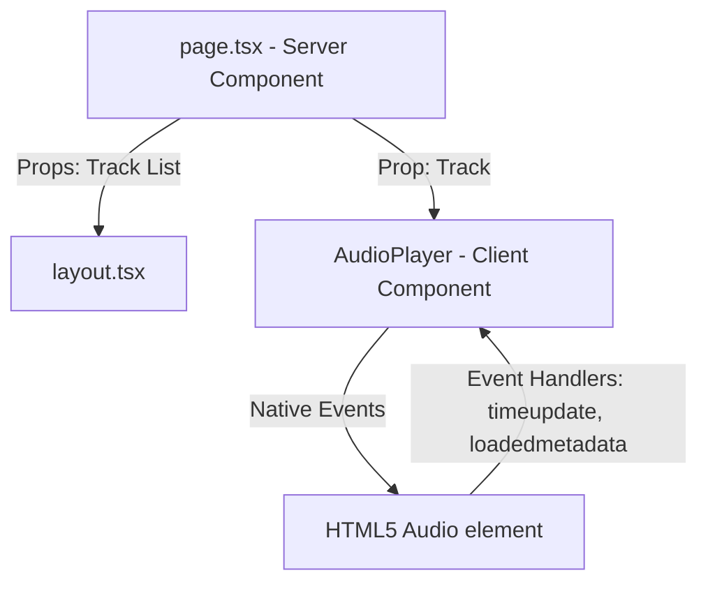

# Technical Design: Next.js Podcast Bootstrap Website

This document specifies the technical design for bootstrapping the Next.js App Router website for team SUPERNOVA.

## 1. Technical Approach

The website will be bootstrapped using Next.js App Router, TypeScript, and Vanilla CSS/CSS Modules. It will follow React Server Component (RSC) patterns by default, isolating client side interactivity inside designated `"use client"` boundaries (specifically the interactive audio player).

## 2. Architecture Decisions

| Option / Choice | Tradeoff | Decision |
|---|---|---|
| **Bootstrapping** | Interactive setup vs scripted setup. Interactive is prone to manual error; scripted setup is repeatable and clean. | Run `npx create-next-app@latest --help` to verify CLI capabilities, then run `./ --typescript --src-dir --app --import-alias "@/*" --tailwind false --use-npm --eslint`. |
| **Font Loading** | Fetching via CDN vs local `next/font/google`. Local optimization avoids Layout Shift (CLS) and works offline. | Standardize via `next/font/google` in layout, exposing CSS variables: `--font-cinzel`, `--font-monsieur-la-doulaise`, `--font-montserrat`. |
| **Responsive CSS** | Tailwind CSS vs Vanilla CSS / CSS Modules. Tailwind offers quick styling but violates project Vanilla CSS styling rules. | Vanilla CSS using Grid/Flexbox layouts. Breakpoints will be configured via `@media` queries with a dark academia/crimson/cream theme. |
| **Audio Player** | Custom browser `<audio>` wrapping vs 3rd party audio libraries. Libraries add bloat; standard HTML `<audio>` elements are lightweight and highly customisable. | React Client Component utilizing native browser `<audio>` API via `useRef` and state variables for tracking play state, scrubbing, and duration. |

## 3. Data Flow



## 4. File Changes

We will create/modify the following files:

1. [package.json](file:///home/nayssakristel/Proyectos/Podcast/package.json): Generated file containing Next.js and React dependencies.
2. [src/app/layout.tsx](file:///home/nayssakristel/Proyectos/Podcast/src/app/layout.tsx): Loads Google Fonts and exports the font variables to the root container.
3. [src/app/globals.css](file:///home/nayssakristel/Proyectos/Podcast/src/app/globals.css): Sets CSS custom properties for fonts and dark academia color theme.
4. [src/app/page.tsx](file:///home/nayssakristel/Proyectos/Podcast/src/app/page.tsx): Main entry page with Hero, Episodes, About, and Contact sections.
5. [src/components/AudioPlayer.tsx](file:///home/nayssakristel/Proyectos/Podcast/src/components/AudioPlayer.tsx): Interactive Client Component displaying the current track info and playback controls.
6. [src/components/AudioPlayer.module.css](file:///home/nayssakristel/Proyectos/Podcast/src/components/AudioPlayer.module.css): Encapsulated styling for the player component matching colors/borders.

## 5. Interfaces & Contracts

### Track Object Contract
```typescript
export interface Track {
  title: string;
  description: string;
  url: string;
  duration: string;
}
```

### AudioPlayer Props Contract
```typescript
export interface AudioPlayerProps {
  track: Track;
}
```

### CSS Theme Properties
```css
:root {
  --color-bg: #F9F6F0; /* Crema/Marfil */
  --color-text: #2E1E1C; /* Dark brown */
  --color-accent-1: #6A2222; /* Borgoña */
  --color-accent-2: #C28D5D; /* Ocre */
}
```

## 6. Testing Strategy

* **Unit Testing / component testing**:
  * Verify state changes inside `AudioPlayer` when calling play, pause, or seeking.
  * Verify responsive grid breakpoints visually across standard devices (Mobile: 375px, Tablet: 768px, Desktop: 1200px).
  * Strict TDD is disabled; standard verification will be performed via browser execution and component inspection.
