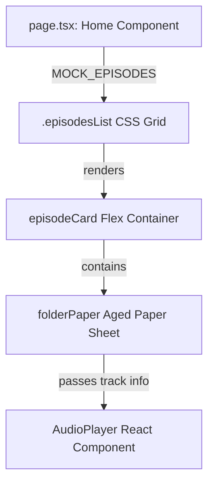

# Technical Design: Refactor Hero and Episodes

This document describes the design for refactoring the landing page Hero section and the Episodes list layout.

## 1. Technical Approach
* **Hero Section**: Remove the redundant text titles (`h1`, `.tagline`) and focus visual attention on the central graphic logo `/logo.png`. Wrap the logo in a stylized `.heroLogoFrame` container with circular borders and vintage sepia blend-modes, centering it and aligning CTA buttons directly below.
* **Episodes Section**: Reorganize the vertical, single-column episodes stack into a responsive CSS Grid gallery (`repeat(3, 1fr)` on desktop). Apply flexbox rules to cards and sub-elements to ensure uniform height across varying content lengths. Compact margins, padding, and typography to fit the narrower grid columns.
* **Audio Player Component**: Update styling rules in `AudioPlayer.module.css` to allow controls to wrap and scale fluidly when rendered within compact card containers.

## 2. Architecture Decisions

| Decision Area | Options Considered | Tradeoffs | Selected Decision |
|---|---|---|---|
| **Hero Redundancy** | 1. Keep text but hide via CSS.<br>2. Complete markup cleanup. | Option 1 is faster but leaves unused DOM nodes.<br>Option 2 reduces HTML size and keeps code clean. | **Option 2**: Remove `h1` and `.tagline` markup entirely from the Hero container. |
| **Episodes Layout** | 1. Flex wrap row.<br>2. CSS Grid. | Option 1 needs margin hacking for alignment.<br>Option 2 provides explicit grid columns and spacing natively. | **Option 2**: CSS Grid layout (`display: grid`). |
| **Card Height Matching** | 1. Fixed heights.<br>2. Flexbox stretching (`height: 100%`). | Option 1 causes overflow if text is long.<br>Option 2 ensures cards stretch dynamically based on grid row height. | **Option 2**: Flexbox layout with `height: 100%` on `.episodeCard` and `.folderPaper`. |
| **Audio Player Scaling** | 1. Responsive media queries.<br>2. Flexible width wrappers. | Option 1 relies on viewport size, not column size.<br>Option 2 makes player adapt to its parent container space. | **Option 2**: Blend flexible flexbox wrapping with viewport media queries. |

## 3. Data Flow
The layout refactoring is purely aesthetic and structural. No logic or data flow changes are required. The episode array (`MOCK_EPISODES`) remains identical, and metadata is passed to `<AudioPlayer>` as before.



## 4. File Changes

### `src/app/page.tsx`
* Remove the `h1` element and the `.tagline` `div` wrapper from the Hero section.
* Wrap `/logo.png` in a container: `<div className={styles.heroLogoFrame}></div>`.
* Move the CTA buttons container directly below `.heroLogoFrame`.

### `src/app/page.module.css`
* Add `.heroLogoFrame` rules:
  * Size: `width: 240px; height: 240px;` (centered via flexbox/margins).
  * Shape: `border-radius: 50%`.
  * Border: `6px double var(--color-accent-2)` (representing the brand double border).
  * Vintage treatment: `filter: sepia(0.35) contrast(1.15) brightness(0.9); mix-blend-mode: multiply;`.
* Convert `.episodesList` to `display: grid; grid-template-columns: repeat(3, 1fr); gap: 2rem;`.
* Compact `.episodeCard` padding to `1.5rem` or `1.75rem` (from `2.5rem 1.5rem 1.5rem 1.5rem`).
* Add flex settings to `.episodeCard` and `.folderPaper`:
  ```css
  .episodeCard {
    display: flex;
    flex-direction: column;
    height: 100%;
    margin-top: 25px;
  }
  .folderPaper {
    display: flex;
    flex-direction: column;
    height: 100%;
    justify-content: space-between;
    padding: 1.5rem 1.25rem;
  }
  ```
* Reduce typography dimensions:
  * `.episodeTitle`: font-size to `1.3rem`, margin-bottom to `0.5rem`.
  * `.episodeText`: font-size to `0.85rem`, margin-bottom to `1rem`.
* Add media query breakpoints:
  * `@media (max-width: 992px)`: `.episodesList { grid-template-columns: repeat(2, 1fr); }`.
  * `@media (max-width: 768px)`: `.episodesList { grid-template-columns: 1fr; }`.

### `src/components/AudioPlayer.module.css`
* Add flex-wrap rules to `.controlsRow` and ensure containers adapt to narrow columns.
* Ensure `.progressContainer` scales down smoothly by reducing `min-width` to `150px` or using flexible percentage-based widths.
* Set `.volumeContainer` to wrap or shrink when width is limited.

## 5. Interfaces / Contracts
The props passed to `<AudioPlayer>` remain unchanged:
```typescript
export interface Track {
  title: string;
  description: string;
  url: string;
  duration: string;
}
export interface AudioPlayerProps {
  track: Track;
}
```

## 6. Testing Strategy
* **Visual Verification**: Check centered centerpiece logo styling, vintage blend-mode filtering, and ocre double border.
* **Grid Layout Verification**: Verify 3 columns on wide screens (>992px), 2 columns on mid screens (768px-992px), and 1 column on mobile (<768px).
* **Flex Height Check**: Verify cards match in height when content varies.
* **Responsive Audio Player**: Test control spacing in narrow cards (ensure sliders, time stamps, and play buttons wrap or scale without overflow).

## 7. Migration / Rollout
Deploy CSS and layout updates concurrently. No database or API changes.
