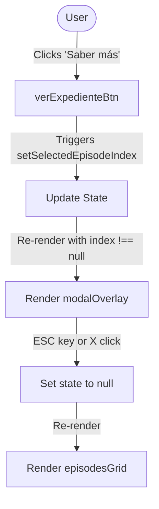

# Technical Design: Refactor Hero Logo and Mini Manila Folders

This document details the design for refactoring the Hero logo size and layout, the episodes list grid constraints, and styling the episode cards as compact, skeuomorphic mini Manila Folders.

## Technical Approach

The implementation will focus on visual refinement and skeuomorphic design consistency:
1. **Hero Logo Scaling**: The main logo in the Hero section is enlarged to a maximum width of `700px` on desktop to establish a prominent focal point. The CTA buttons are centered directly below.
2. **Constrained Episodes Grid**: The episodes grid container width is restricted to `960px` max-width and centered to create a dense, structured dashboard.
3. **Mini Manila Folder Cards**: Individual episode cards are styled as compact Manila Folders using CSS flexbox for uniform height. Key physical details like an folder tab with label, a mini CSS paperclip, and radial CSS coffee stains are added.
4. **Action Button & Modal Integration**: The episode action button is renamed to "Saber más" while retaining its click-to-open logic for the details modal.

---

## Key Architecture Decisions

| Option | Tradeoff | Decision |
| :--- | :--- | :--- |
| **Option A**: Mutate existing `.episodeCard` styles to support the folder theme | **Pros**: Keeps markup unchanged. **Cons**: High risk of styling pollution and conflicts with full-sized modal folder styles. | **Reject** |
| **Option B**: Introduce dedicated `.miniFolder` and `.miniFolderPaper` classes | **Pros**: Separation of concerns; isolated styling for grid cards and modal views; easier mobile responsiveness. **Cons**: Minor CSS file size increase. | **Select** |

---

## Data Flow & Interactions

* **Playback**: Spacing inside `AudioPlayer` is adjusted via classes in [page.module.css](file:///home/nayssakristel/Proyectos/Podcast/src/app/page.module.css) to prevent overlap with the paperclip and button.

---

## File Changes

### 1. [page.tsx](file:///home/nayssakristel/Proyectos/Podcast/src/app/page.tsx)
* Replace `.episodeCard` structures inside the `MOCK_EPISODES.map` render loop:
  * Wrap in `.miniFolder`.
  * Add the `.miniFolderTab` containing a monospace label `.miniFolderTabLabel` displaying `"CASO: EP-XX"`.
  * Within `.miniFolder`, nest `.miniFolderPaper` containing `.miniPaperClip`, `.miniCoffeeStain` (conditional or static), description, metadata, title, and compact `AudioPlayer`.
  * Update the text of `.verExpedienteBtn` to `"Saber más"`.

### 2. [page.module.css](file:///home/nayssakristel/Proyectos/Podcast/src/app/page.module.css)
* **Hero Styles**:
  * Update `.heroLogo` properties: `width: 100%; max-width: 700px; aspect-ratio: 1/1; object-fit: contain; margin-bottom: 2rem; mix-blend-mode: multiply; filter: sepia(0.2) contrast(1.1) brightness(0.95);`
  * Add centering alignment for `.heroCtas` container under the logo.
* **Grid Styles**:
  * Update `.episodesList`: `max-width: 960px; margin: 0 auto; display: grid; grid-template-columns: repeat(3, 1fr); gap: 2rem;`. Add a media query for a single-column layout on screens `< 768px`.
* **Mini Folder Styles**:
  * Add `.miniFolder`: `background-color: #dfcda7; border: 2px solid #bfa47e; border-radius: 6px; display: flex; flex-direction: column; height: 100%; position: relative; margin-top: 25px;`.
  * Add `.miniFolderTab`: `background-color: #dfcda7; border: 2px solid #bfa47e; border-bottom: none; border-radius: 8px 8px 0 0; padding: 0 0.75rem; height: 22px; position: absolute; top: -21px; left: 15px; display: flex; align-items: center; justify-content: center;`.
  * Add `.miniFolderTabLabel`: `font-size: 0.65rem; font-family: var(--font-family-monospace); font-weight: 700; color: #5b4632;`.
  * Add `.miniFolderPaper`: `background-color: #faf7f0; border: 1px solid #dcd4c3; padding: 1.25rem; border-radius: 2px; box-shadow: inset 0 0 20px rgba(0, 0, 0, 0.02); display: flex; flex-direction: column; flex-grow: 1; margin-top: 15px; position: relative;`.
  * Add `.miniPaperClip`: `position: absolute; top: -10px; right: 20px; width: 12px; height: 32px; border: 1.5px solid #9c9a96; border-radius: 8px; z-index: 10; transform: rotate(15deg);`. Include pseudo-element `::after` for the inner wire look.
  * Add `.miniCoffeeStain`: `position: absolute; width: 80px; height: 80px; border-radius: 50%; background: radial-gradient(circle, rgba(139, 90, 43, 0.04) 0%, transparent 60%); pointer-events: none; z-index: 5;`.
* **Text Clamp**:
  * Apply `line-clamp: 2` on `.episodeTitleCompact` and `line-clamp: 3` on `.episodeDescription` to maintain uniform heights.

### 3. [AudioPlayer.module.css](file:///home/nayssakristel/Proyectos/Podcast/src/components/AudioPlayer.module.css)
* Verify margins and padding inside mini folder cards. If required, reduce player container paddings or layout margins to fit nicely inside the `1.25rem` padded `.miniFolderPaper`.

---

## Testing Strategy

* **Visual Verification**:
  1. Confirm Hero logo displays centered with a maximum width of `700px` on desktop viewports.
  2. Confirm episodes grid is constrained to `960px` max-width and centered.
  3. Verify card elements (tab label, paperclip, coffee stains, folder colors) render properly without layout shift.
  4. Ensure line clamping prevents overflow when description lengths vary.
* **Interactive Verification**:
  1. Click the "Saber más" button and verify the full folder details modal opens correctly.
  2. Confirm close actions (ESC key, clicking background overlay, or clicking close button) successfully dismiss the modal.
